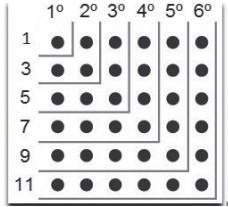

# Laboratório 3 - MVN 2

## Instruções Iniciais

Neste laboratório, daremos continuidade ao trabalho do laboratório passado. Você deve criar os seguintes programas em linguagem de Máquina de Vendas de Números (MVN):

## Exercícios

### triangulos.mvn

Desenvolva um programa que determine, para três valores a, b e c, se estes valores:

- Não formam um triângulo
- Formam um triângulo retângulo
- Formam um triângulo acutângulo
- Formam um triângulo obtusângulo

Os valores devem ser armazenados nas posições de memória 0x010, 0x012 e 0x014, e o resultado deve ser armazenado na posição `0x016`.

### op-mnem.mvn

Desenvolva duas sub-rotinas (`OP2MNEM` e `MNEM2OP`), cujas finalidades são:

#### OP2MNEM (Endereço Inicial 0x100)

Converte um número inteiro dado, `0 ≤ n ≤ 15`, localizado na posição de memória `OPCODE` (0x010), para o mnemônico correspondente, formado por dois caracteres ASCII. O mnemônico deve ser armazenado na posição de memória `MNEM` (0x012).

### MNEM2OP (Endereço Inicial 0x200)

Realiza a conversão oposta, transformando um mnemônico válido localizado em `MNEM`, dado como dois caracteres ASCII, em um número inteiro correspondente, `0 ≤ n ≤ 15`, armazenado na posição de memória `OPCODE`.

### Programa Principal (Endereço Inicial 0x300)

Um pequeno programa principal deve ilustrar o uso das duas sub-rotinas.

Observação: Ambos os parâmetros, `MNEM` e `OPCODE`, são representados como inteiros, ocupando cada qual dois bytes de memória.

Exemplo de operação:

- Dado o `OPCODE` 0x0001, armazenado na posição `OPCODE` e `OPCODE + 1` de memória, contendo respectivamente os bytes 00 e 01, a sub-rotina `OP2MNEM` deve retornar o par de letras JZ (jump if zero), cujos códigos ASCII são 4A e 5A. Em outras palavras, a posição de memória `MNEM` deverá conter o byte 0x4A e a posição `MNEM+1` deverá conter o byte 0x5A.

- Dado o mnemônico JZ em (`MNEM`, `MNEM+1`), ou seja, dado o par de bytes (0x4A, 0x5A), a sub-rotina `MNEM2OP` retornará em (`OPCODE`, `OPCODE+1`) o par de bytes (00, 01).

### quadrados-perfeitos.mvn

Desenvolva um programa para a MVN que calcule e tabele, a partir da posição de memória 0x100, os quadrados perfeitos dos 64 primeiros números naturais (0x0, 0x1, 0x2, ..., 0x3F). O cálculo deverá ser realizado aplicando a seguinte propriedade:

$$n^2=\sum_{i=0}^{n-1}(2i+1)$$

Cada quadrado calculado deverá ser armazenado como um inteiro de dois bytes, iniciando na posição de memória 0x100. Ao final da execução, os valores das posições de memória serão:

| Posição (hexa) | Valor (hexa) | Valor (decimal) | N   |
| -------------- | ------------ | --------------- | --- |
| 100            | 0000         | 0               | 0   |
| 102            | 0001         | 1               | 1   |
| 104            | 0004         | 4               | 2   |
| ...            | ...          |                 | ... |
| 1??            | 0???         | 3969            | 63  |

Observação: Caso você encontre problemas devido ao evitador de loops infinitos, você pode ajustar o valor do número máximo de passos acionando a flag `-s [valor]` ou `--max_step [valor]`, substituindo `[valor]` pelo limite de passos desejado ao chamar o módulo `mvnMonitor.py`.

#### Demostração Intuitiva da Fórmula

